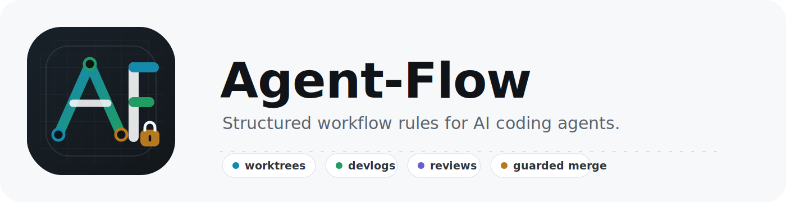

<p align="center">
  
</p>

# Agent-Flow

Structured workflow rules for AI coding agents.

Agent-Flow is a portable setup for solo development with Codex, Claude, and other coding agents. It gives file-changing agent work a repeatable lifecycle: create one session worktree, make a scoped change, write the devlog, finish with review, ask before merge, and check readiness before release.

It exists because capable agents still need reliable rails. Without a shared workflow, parallel sessions can drift across branches, skip documentation, overwrite work, or leave weak handoff records. Agent-Flow makes the development loop inspectable, portable, and easier to trust.

## Why It Matters

- **Control parallel work:** keep agent sessions isolated in worktrees instead of letting them collide on the parent branch.
- **Preserve engineering memory:** write finish-time `devlog/` entries instead of burying decisions in chat history.
- **Keep docs current:** update user, architecture, workflow, visual, and marketing docs when behavior changes.
- **Protect release paths:** use review, release readiness, optional security review, and push-readiness checks.
- **Stay agent-agnostic:** use one canonical `AGENT-FLOW.md`, with adapters for Codex-compatible agents and Claude-compatible agents.

## What It Installs

- Canonical workflow rules in `AGENT-FLOW.md`.
- Agent adapters: `AGENTS.md` for Codex-compatible agents and `CLAUDE.md` for Claude-compatible agents.
- Compact AF skills:
  - `af-help`
  - `af-brand-guidelines`
  - `af-flow`
  - `af-status`
  - `af-devlog`
  - `af-finish`
  - `af-show`
  - `af-review`
  - `af-reconcile`
  - `af-full-review`
  - `af-release`
  - `af-security-review`
  - `af-docs`
  - `af-feature-audit`
  - `af-ui-audit`
  - `af-migrate-backlog-devlog`
- Scripts for install, repo init, session lifecycle, branch safety, push readiness, hooks, and worktree management.
- Templates for repo instructions, config, devlog entries, gitignore blocks, and decision records.
- Brand and launch assets under `docs/BRAND-GUIDELINES.md` and `docs/assets/`.

## Install

```bash
chmod +x scripts/install.sh
./scripts/install.sh
```

Default destinations:

- `~/.agent-flow` for shared AF files
- `~/.codex` for Codex adapter, skills, scripts, docs, and templates
- `~/.claude` for Claude adapter

Override locations:

```bash
AF_HOME=/path/to/agent-flow CODEX_HOME=/path/to/codex CLAUDE_HOME=/path/to/claude ./scripts/install.sh
```

Reinstalling removes retired AF skill and script names from the install targets before copying the current compact set.

## Initialize A Repo

Inside a Git repository:

```bash
~/.agent-flow/scripts/init-repo.sh
```

Init creates missing AF files and writes `.agent-flow/config.toml` with local choices:

- enforcement enabled or disabled
- session worktrees required for file-changing work
- detached session worktrees by default
- named branches only when explicitly requested
- ask-before-merge
- devlog required for file-changing sessions
- checked-out parent branch as the merge target
- `development` as integration branch
- optional `staging` between `development` and `main`
- protected/reserved branch policy
- optional pre-push hook for child session readiness
- repo-local helper scripts under `scripts/` for session start, finish, push readiness, hook install, branch safety, and worktree management

## Daily Loop

For file-changing work:

```text
af-flow -> implement -> af-devlog -> af-finish
```

For read-only repo and worktree status:

```text
af-status
```

For command help:

```text
af-help
```

For explicit app-wide feature/user-story QA campaigns:

```text
af-feature-audit
```

For brand/design guideline setup:

```text
af-brand-guidelines
```

For explicit responsive UI/UX audit campaigns:

```text
af-ui-audit
```

Direct helpers:

```bash
scripts/start-session.sh feat export-csv
scripts/finish-session.sh
scripts/finish-session.sh --merge
```

`finish-session.sh` reports `ASK_USER_MERGE`; run `--merge` only after approval.

Create a named branch only on request:

```bash
scripts/start-session.sh --branch feat/export-csv feat export-csv
```

## Release Loop

```text
af-reconcile -> af-full-review -> af-release
```

Run `af-security-review` when requested, config-required, or security-sensitive.

Default release path is `development -> staging -> main`. With staging disabled or explicitly skipped, use `development -> main`.

## Documentation

- [Agent-Flow Usage Guide](docs/AGENT-FLOW-USAGE.md)
- [Brand Guidelines](docs/BRAND-GUIDELINES.md)
- [Workflow](docs/WORKFLOW.md)
- [User Guide](docs/USER-GUIDE.md)
- [Architecture](docs/ARCHITECTURE.md)
- [Prompt Examples](docs/AGENT-PROMPTS.md)
- [Documentation Strategy](docs/DOCS-STRATEGY.md)
- [Visual Plan](docs/VISUALS.md)
- [Demo Plan](docs/DEMO.md)
- [Pitch](docs/PITCH.md)
- [Changelog](CHANGELOG.md)

## Public Repo Goals

Agent-Flow should make a visitor understand the project within one minute:

1. AI coding agents need shared operating rules, not just stronger prompts.
2. Worktree sessions, devlogs, review, and push checks are the core behavior.
3. The workflow is agent-agnostic, with Codex and Claude support included.
4. The repo is useful today as an installable local workflow kit.
5. The documentation and brand assets are part of the product, not an afterthought.

## Brand Direction

Use Agent-Flow's own brand system rather than copying another company's design language. OpenAI-style restraint is a better influence than a broad Google-style consumer palette because Agent-Flow is an engineering workflow product: it should feel precise, calm, credible, and operational. See [Brand Guidelines](docs/BRAND-GUIDELINES.md) for the full system.

## Key Rule

`devlog/` is the durable human history. Git config metadata is intentionally small and exists only so finish, reconcile, and push-readiness can route work safely.
