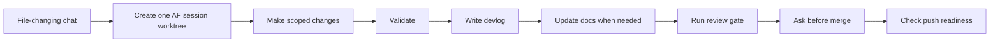

<p align="center">
  
</p>

# Agent-Flow

Structured workflow rules for AI coding agents.

Agent-Flow gives solo developers a repeatable operating model for Claude, Codex, and other coding agents: one file-changing chat maps to one isolated worktree session, every session leaves a devlog, and merges go through validation, docs checks, review, and explicit approval.

It exists because capable agents still need reliable rails. Without a shared workflow, parallel agent sessions can drift across branches, skip documentation, leave weak handoff records, or push changes before the repo is ready. Agent-Flow makes the development loop inspectable, portable, and easier to trust.

## Why It Matters

- **Control parallel work:** keep agent sessions isolated in worktrees instead of letting them collide on the parent branch.
- **Preserve engineering memory:** write finish-time `devlog/` entries instead of burying decisions in chat history.
- **Keep docs current:** update user, architecture, workflow, visual, and marketing docs when behavior changes.
- **Protect release paths:** use review gates, push-readiness checks, and formal security review before protected-branch pull requests.
- **Stay agent-agnostic:** use one canonical `AGENT-FLOW.md`, with adapters for Codex-compatible agents and Claude-compatible agents.

## What Is Included

| Area | Files |
|---|---|
| Canonical workflow | `AGENT-FLOW.md` |
| Agent adapters | `AGENTS.md`, `CLAUDE.md` |
| Codex-compatible skills | `skills/af-*` |
| Session lifecycle scripts | `scripts/start-session.sh`, `scripts/finish-session.sh`, `scripts/worktree-manager.py` |
| Safety checks | `scripts/check-branch-safety.sh`, `scripts/check-push-readiness.sh`, `scripts/review-snapshot.sh` |
| Repo bootstrap templates | `templates/` |
| Public docs and positioning | `docs/`, `docs/assets/`, `CHANGELOG.md`, this `README.md` |

## Install

From this folder:

```bash
chmod +x scripts/install.sh
./scripts/install.sh
```

The installer writes the shared setup to `~/.agent-flow` by default. It also installs Codex-compatible adapters and skills to `~/.codex`, and a Claude adapter to `~/.claude`.

Override locations when needed:

```bash
AF_HOME=/path/to/agent-flow CODEX_HOME=/path/to/codex CLAUDE_HOME=/path/to/claude ./scripts/install.sh
```

## Initialize A Repo

Inside a Git repository:

```bash
~/.agent-flow/scripts/init-repo.sh
```

Init records local choices in `.agent-flow/config.toml` and creates missing workflow scaffolding:

- `AGENT-FLOW.md`
- `AGENTS.md`
- `CLAUDE.md`
- `.gitignore` Agent-Flow block
- `devlog/README.md`
- `docs/decisions/`
- `docs/solutions/`
- `docs/plans/`
- `docs/diagrams/`
- `docs/assets/`
- `docs/presentations/`

Use bootstrap only when you want to copy missing files without recording first-contact choices:

```bash
~/.agent-flow/scripts/bootstrap-repo.sh
```

## Daily Loop



## Core Commands

Start a session worktree from the checked-out parent branch:

```bash
scripts/start-session.sh docs refresh-readme
```

Finish a session with validation, devlog/docs checks, review, and merge readiness:

```bash
scripts/finish-session.sh
```

Inspect or pick up worktrees:

```bash
scripts/worktree-manager.py --interactive
```

Check whether a parent branch is ready to push:

```bash
scripts/check-push-readiness.sh development
```

## Skills

Agent-Flow ships Markdown-based skills that agents can read as workflow instructions. The current repo includes:

- `af-devlog` for finish-time engineering history.
- `af-docs` for docs, diagrams, guides, demos, decks, and marketing content.
- `af-flow-finish` for completing a session with validation, review, docs checks, and merge readiness.
- `af-migrate-backlog-devlog` for converting legacy backlog/task stores into `devlog/` entries.
- `af-reconcile` for auditing, picking up, and cleaning up worktree sessions.
- `af-release` for protected release pull request preparation.
- `af-review` for pre-merge review gates.
- `af-security-review` for formal security review before protected-branch pull requests.

## Documentation Map

- [Brand Guidelines](docs/BRAND-GUIDELINES.md) - positioning, messaging, visual identity, voice, and launch surfaces.
- [User Guide](docs/USER-GUIDE.md) - install, init, skill selection, migration, visual docs, and release PRs.
- [Workflow](docs/WORKFLOW.md) - branch model, daily loop, migration, and release PRs.
- [Architecture](docs/ARCHITECTURE.md) - system map, install flow, init/bootstrap flow, and skill routing diagrams.
- [Documentation Strategy](docs/DOCS-STRATEGY.md) - how `af-docs` owns ongoing docs maintenance.
- [Visual Plan](docs/VISUALS.md) - diagram inventory, screenshot checklist, demo video plan, and content recommendations.
- [Demo Plan](docs/DEMO.md) - live demo and recording script.
- [Pitch](docs/PITCH.md) - positioning, value props, objections, and marketing recommendations.
- [Prompt Examples](docs/AGENT-PROMPTS.md) - reusable prompts for Agent-Flow work.
- [Changelog](CHANGELOG.md) - user-facing workflow, docs, skill, and setup changes.

## Public Repo Goals

Agent-Flow should make a visitor understand the project within one minute:

1. AI coding agents need shared operating rules, not just stronger prompts.
2. Worktree sessions, devlogs, review gates, and push checks are the core behavior.
3. The workflow is agent-agnostic, with Codex and Claude support included.
4. The repo is useful today as an installable local workflow kit.
5. The documentation is part of the product, not an afterthought.

## Brand Direction

Use Agent-Flow's own brand system rather than copying another company's design language. OpenAI-style restraint is a better influence than a broad Google-style consumer palette because Agent-Flow is an engineering workflow product: it should feel precise, calm, credible, and operational. See [Brand Guidelines](docs/BRAND-GUIDELINES.md) for the full system.

## Manual Install

```bash
mkdir -p ~/.agent-flow ~/.codex ~/.claude
mkdir -p ~/.agent-flow/skills ~/.agent-flow/templates ~/.agent-flow/scripts ~/.agent-flow/docs ~/.codex/skills
cp AGENT-FLOW.md ~/.agent-flow/AGENT-FLOW.md
cp AGENTS.md ~/.codex/AGENTS.md
cp AGENT-FLOW.md ~/.codex/AGENT-FLOW.md
cp CLAUDE.md ~/.claude/CLAUDE.md
cp AGENT-FLOW.md ~/.claude/AGENT-FLOW.md
cp -R skills/. ~/.agent-flow/skills/
cp -R templates/. ~/.agent-flow/templates/
cp -R scripts/. ~/.agent-flow/scripts/
cp -R docs/. ~/.agent-flow/docs/
cp -R skills/. ~/.codex/skills/
```

## Intended Behavior

Agent-Flow treats heavier planning or multi-agent workflows as optional power mode. The non-negotiable workflow rules live in `AGENT-FLOW.md`; adapters and skills help different agents enter the same process.

Use Agent-Flow when you want agent-assisted development to leave behind clean branches, readable history, maintained docs, and reviewable release paths.
