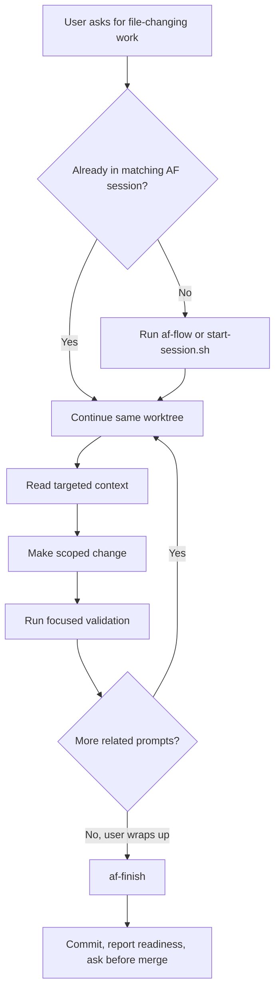
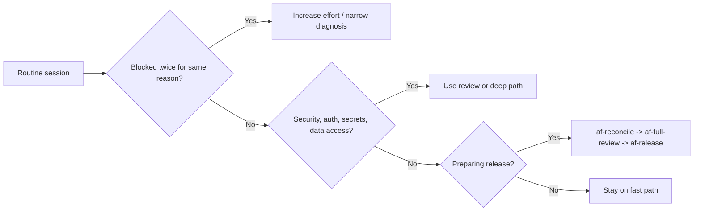
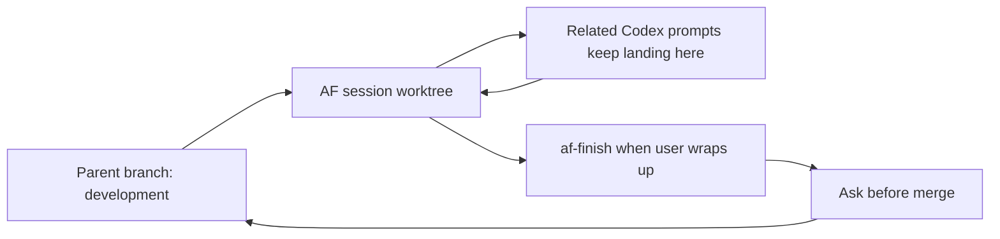

# Agent-Flow Codex Fast Path Guide

This guide is the practical operating model for using Agent-Flow with Codex while keeping work fast, scoped, and token-efficient.

Use the PDF version when sharing or printing:

```text
docs/agent-flow-codex-fast-path-guide.pdf
```

## The Short Version

Agent-Flow should feel like one persistent Codex work session, not a ceremony after every prompt.

```text
start or continue one AF worktree -> keep working there -> wrap up when you ask
```

For most work, keep the visible command set to five actions:

| Moment | Action |
|---|---|
| Start or continue file-changing work | `af-flow` |
| Check current state | `af-status` |
| Ask for a quick checkpoint | `af-review` |
| Pick up, audit, or clean worktrees | `af-reconcile` |
| Commit and prepare to merge | `af-finish` |

Specialist skills are still available, but they are not part of every session.

## Daily Flow



## Token-Efficient Model Policy

Start with the cheapest setting that matches the risk.

| Work | Codex setting |
|---|---|
| Read-only help, status, command lookup | `fast` profile or base medium |
| Routine implementation | base `gpt-5.5` / medium / low verbosity |
| Risky diff, hard debugging, release review | `review` profile or high effort |
| Security-sensitive or repeatedly failing work | `deep` profile or xhigh effort |

Do not start routine sessions at `xhigh`. Escalate after evidence: repeated failure, risky scope, release gate, or security-sensitive changes.

## What To Avoid In Routine Sessions

Avoid spending tokens on:

- full repo scans when targeted file reads are enough
- full reviews before the user asks for review or release
- security reviews for non-security changes
- visual capture when no UI, rendered doc, or CLI artifact needs inspection
- feature/UI audit campaigns unless explicitly requested
- subagent fan-out without narrow stop conditions

## When To Escalate



## Worktree Mental Model



The session worktree is the durable working context. Chat can be fluid; the worktree keeps the files, Git metadata, and devlog grounded.

## Practical Prompts

Start or continue work:

```text
Use af-flow for this file-changing request. Keep related work in the same AF session worktree until I ask to finish, review, reconcile, merge, or switch direction.
```

Check status:

```text
Use af-status and tell me what AF sessions are active or ready.
```

Wrap up:

```text
Use af-finish. Validate, update the devlog, commit the session, and report the merge command.
```

Release:

```text
Use af-reconcile, then af-full-review, then af-release.
```

## The Rule Of Thumb

If the work is routine, stay light. If the work is risky, blocked, or release-facing, escalate deliberately.
