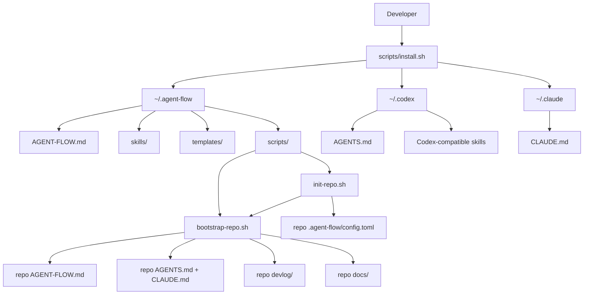
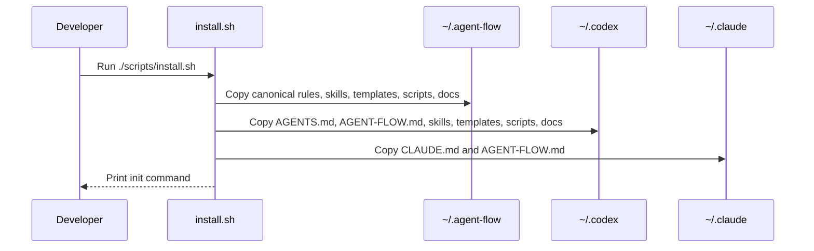
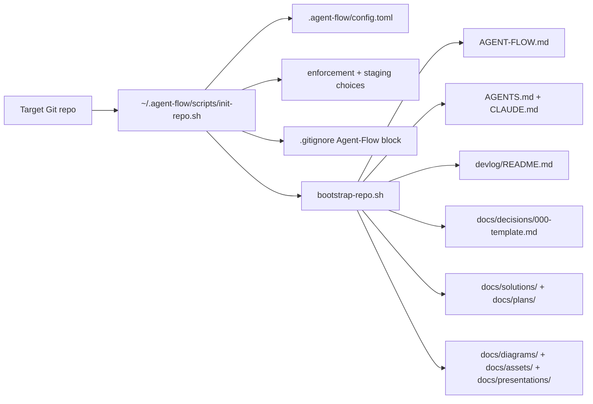
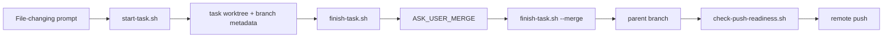

# Agent-Flow Architecture

Agent-Flow is a portable setup package for solo developers using Claude, Codex, or other coding agents. It provides shared workflow rules, agent-specific adapters, reusable AF skills, repo bootstrap templates, and small safety scripts.

## System Map

## Repository Components

| Path | Role |
|---|---|
| `AGENT-FLOW.md` | Canonical workflow rules shared across agents. |
| `AGENTS.md` | Codex-compatible adapter that points to `AGENT-FLOW.md`. |
| `CLAUDE.md` | Claude-compatible adapter that points to `AGENT-FLOW.md`. |
| `skills/` | AF workflow skills in Codex-compatible `SKILL.md` format. |
| `scripts/` | Portable shell helpers for install, init, bootstrap, task lifecycle, push readiness, hooks, worktrees, branch checks, and review snapshots. |
| `templates/` | Repo-level instruction, devlog, and decision templates. |
| `docs/` | Project documentation, visual plans, prompts, guides, and communication assets. |
| `devlog/` | Per-commit engineering history and validation records. |

## Install Flow

## Repo Init And Bootstrap Flow

`init-repo.sh` records first-contact repo choices, including whether Agent-Flow enforcement is enabled, whether staging is used, and whether the local pre-push hook was installed. It also ensures `.gitignore` has the Agent-Flow local/IDE/env block and notes staging-disabled repos in local agent adapters.

`bootstrap-repo.sh` only copies missing files. Existing repo instructions and docs are left in place.

## Skill Model

Skills are written as Markdown workflows. Codex can auto-discover them through its skill format; other agents can still read them directly as reusable process instructions.

## Task Lifecycle Scripts

## Data and State

Agent-Flow has no database or service runtime. State is file-based:

- Global setup files under `~/.agent-flow`, `~/.codex`, and `~/.claude`.
- Repo-level instructions and docs copied into target repositories.
- Repo-level choices stored in `.agent-flow/config.toml`.
- Repo-level ignore policy stored in `.gitignore`.
- Task branch parent metadata stored in Git config as `branch.<task-branch>.agentFlowParent`.
- Task class and lifecycle state stored in Git config as `agentFlowTaskClass` and `agentFlowState`.
- Git branches, worktrees, and commits managed by the developer.
- Engineering history stored in repo `devlog/` files.

## Trust Boundaries

- Install scripts write to local home directories and should be reviewed before running.
- Init and bootstrap scripts write into the current Git repository and refuse to run outside a Git repo.
- Staging promotion and cleanup skills require explicit approval before destructive actions such as branch deletion or worktree removal.
- `main` is production and direct agent changes are blocked by workflow. `staging` is optional, but protected/reserved when present.
- Optional local `pre-push` hooks call `check-push-readiness.sh` so parent branches are not pushed while child task worktrees are dirty or unmerged.
- Generated docs and visuals must be grounded in source files, devlog entries, screenshots, or user-provided context.
