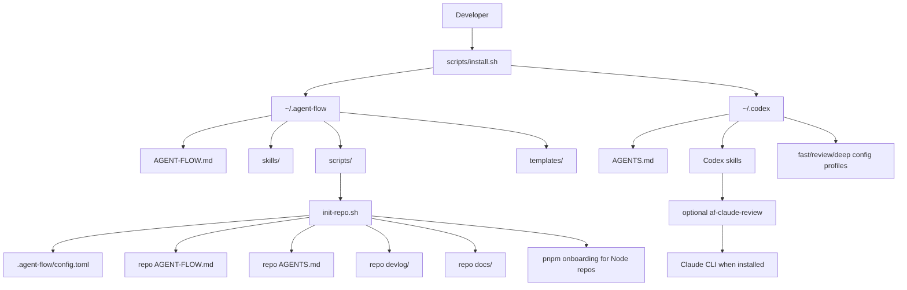
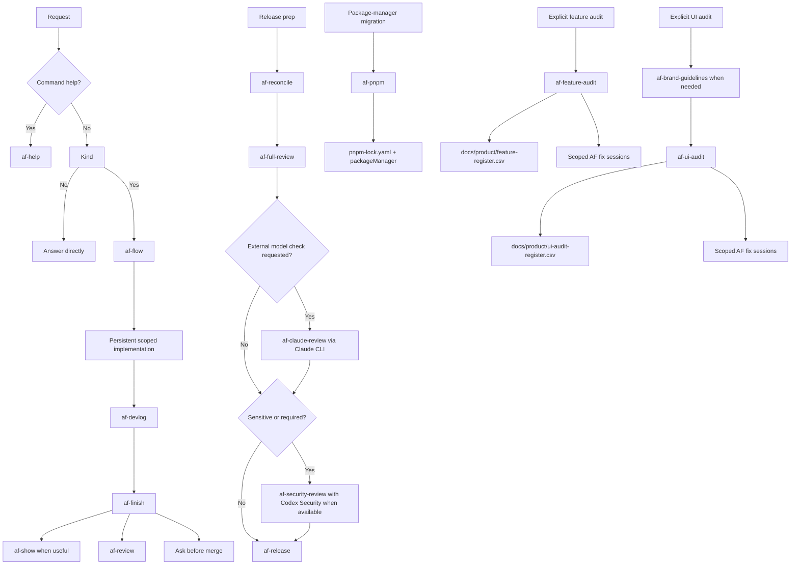
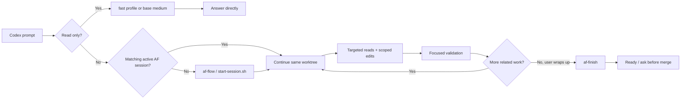
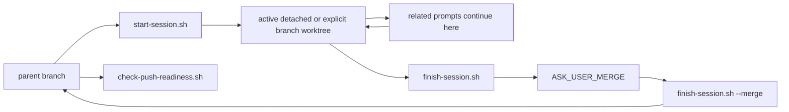
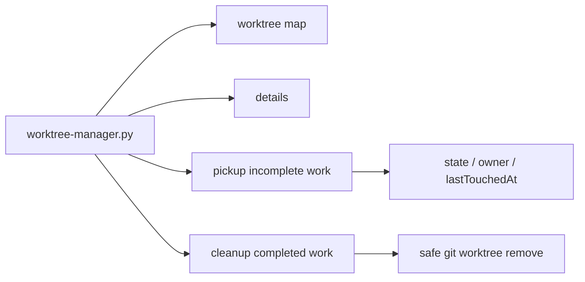

# Agent-Flow Architecture

Agent-Flow is a Codex-focused local setup package. It installs workflow rules, Codex skills, templates, and scripts that keep file-changing Codex work isolated and reviewable.

## System Map

## Repository Components

| Path | Role |
|---|---|
| `AGENT-FLOW.md` | Canonical workflow rules. |
| `AGENTS.md` | Codex adapter. |
| `skills/` | AF workflows in `SKILL.md` format. |
| `scripts/` | Install, init, session, readiness, hook, and worktree helpers. |
| `templates/` | Repo instruction, config, devlog, gitignore, and decision templates. |
| `docs/` | Workflow, user, architecture, visual, demo, and prompt docs. |
| `devlog/` | Session engineering history. |

## Skill Flow

## Fast Path Routing

## Session Scripts

## Worktree Manager

## State

Agent-Flow has no service runtime. State is local:

- Global files under `~/.agent-flow` and `~/.codex`.
- Repo choices in `.agent-flow/config.toml`.
- Session metadata in worktree-local Git config.
- Optional branch parent metadata for explicit branches.
- Human history in `devlog/`.
- Git commits, worktrees, and branches.

## Trust Boundaries

- Install scripts write to local home directories.
- Init scripts write into the current Git repo and refuse to run outside Git.
- Worktree cleanup and release side effects require explicit approval.
- Direct work on `main` is blocked by workflow.
- Push-readiness blocks parent pushes while child sessions are dirty or unmerged.
- Security review is distinct from full release review.
