# Agent-Flow User Guide

This guide covers the common workflows for installing Agent-Flow, bootstrapping a repo, and choosing the right AF skill.

## Install Agent-Flow

From the setup repo:

```bash
chmod +x scripts/install.sh
./scripts/install.sh
```

The installer writes:

- shared Agent-Flow files to `~/.agent-flow`
- Codex adapter and skills to `~/.codex`
- Claude adapter to `~/.claude`

Use environment variables when you need custom install locations:

```bash
AF_HOME=/path/to/agent-flow CODEX_HOME=/path/to/codex CLAUDE_HOME=/path/to/claude ./scripts/install.sh
```

## Bootstrap a Project Repo

Inside a target Git repo:

```bash
~/.agent-flow/scripts/bootstrap-repo.sh
```

This creates missing:

- `AGENT-FLOW.md`
- `AGENTS.md`
- `CLAUDE.md`
- `devlog/README.md`
- `docs/decisions/000-template.md`
- `docs/solutions/`
- `docs/plans/`
- `docs/diagrams/`
- `docs/assets/`
- `docs/presentations/`

The script does not overwrite existing files.

## Daily Agent-Flow Loop

```mermaid
flowchart LR
    Start["Start from development"] --> Branch["Create branch or worktree"]
    Branch --> Skill["Use lightest AF skill"]
    Skill --> Change["Implement scoped change"]
    Change --> Validate["Run validation"]
    Validate --> Devlog["Add devlog entry"]
    Devlog --> Docs["Update docs and visuals if needed"]
    Docs --> Review["Run af-review-gate"]
    Review --> Merge["Merge to development"]
```



## Choose a Skill

| Need | Skill |
|---|---|
| Tiny code or docs fix | `af-small-change` |
| Parallel isolated work | `af-worktree-task` |
| Engineering history | `af-devlog` |
| Project docs, diagrams, guides, demos, decks, or marketing content | `af-docs` |
| Convert legacy Backlog task files to devlog entries | `af-migrate-backlog-devlog` |
| Review before merge | `af-review-gate` |
| Audit worktrees and branch cleanup candidates | `af-reconcile-worktrees` |
| Promote `development` to `staging` | `af-push-staging` |
| Decide whether a heavier workflow is needed | `af-compound-mode` |

## Migrate Legacy Backlog Files

Dry-run first:

```bash
python3 ~/.agent-flow/skills/af-migrate-backlog-devlog/scripts/migrate_backlog_to_devlog.py /path/to/repo
```

Write devlog entries after reviewing the plan:

```bash
python3 ~/.agent-flow/skills/af-migrate-backlog-devlog/scripts/migrate_backlog_to_devlog.py /path/to/repo --write
```

Do not delete legacy Backlog files until the generated devlog entries are reviewed.

## Create Visual Docs

Use `af-docs` when the repo needs to be easier to understand or present.

Good defaults for Agent-Flow repos:

- Mermaid diagrams for architecture and workflows.
- Markdown guides for developer/operator instructions.
- Presentation outlines before building slide decks.
- Demo scripts and screenshot lists before recording videos.
- Generated images only for marketing or conceptual visuals when real product screenshots are not available.

## Promote to Staging

Use this sequence:

```text
af-reconcile-worktrees -> af-docs -> af-push-staging
```

The flow checks worktree state, updates docs, validates `development`, merges to `staging`, pushes both branches, and asks before creating a `staging` to `main` pull request.
