# Agent-Flow User Guide

This guide covers the common workflows for installing Agent-Flow, initializing a repo, and choosing the right AF skill.

## Install Agent-Flow

From the setup repo:

```bash
chmod +x scripts/install.sh
./scripts/install.sh
```

The installer writes:

- shared Agent-Flow files to `~/.agent-flow`
- Codex adapter and skills to `~/.codex`
- Claude adapter to `~/.claude`

Use environment variables when you need custom install locations:

```bash
AF_HOME=/path/to/agent-flow CODEX_HOME=/path/to/codex CLAUDE_HOME=/path/to/claude ./scripts/install.sh
```

## Initialize a Project Repo

Inside a target Git repo:

```bash
~/.agent-flow/scripts/init-repo.sh
```

Init creates missing bootstrap files, then records local choices in `.agent-flow/config.toml`:

- `AGENT-FLOW.md`
- `AGENTS.md`
- `CLAUDE.md`
- `.agent-flow/config.toml`
- `devlog/README.md`
- `docs/decisions/000-template.md`
- `docs/solutions/`
- `docs/plans/`
- `docs/diagrams/`
- `docs/assets/`
- `docs/presentations/`

The script asks whether to disable Agent-Flow enforcement for this repo, whether the repo uses optional `staging`, and whether to install a local pre-push hook. It also creates or appends a non-destructive Agent-Flow `.gitignore` block. If staging is disabled, the local agent adapters note that agents should not assume a staging branch.

Use `bootstrap-repo.sh` only when you want to copy missing files without recording first-contact repo choices.

Gitignore and IDE defaults:

- `.gitignore` should ignore local Agent-Flow overrides, env files, OS/editor noise, logs, temp files, and personal IDE state.
- `.vscode/extensions.json`, `.vscode/tasks.json`, `.vscode/launch.json`, and `.vscode/settings.json` may be committed only when they encode shared project tooling.
- Personal IDE preferences such as themes, window titles, UI layout, local paths, or machine-specific interpreters should stay untracked.

Worktree defaults:

- Session worktrees are detached from the checked-out parent branch by default and merge back there.
- Named branches are created only when the user explicitly requests a branch.
- File-changing chats use one AF session worktree.
- Agents ask before merge by default.
- Formal security review is required before protected-branch pull requests to `staging` or `main`.
- `development` is the SDLC integration branch.
- `main` is the production PR target and should not be kept as a local work branch.
- `staging` is optional in the release path. Keep a local `staging` branch only when `staging_enabled = true`; otherwise flag it for cleanup.
- `master`, `production`, and `prod` are reserved legacy branch names.

## Daily Agent-Flow Loop

```mermaid
flowchart LR
    Prompt["User chat"] --> Decide["Read-only or file-changing"]
    Decide --> Worktree["Create or adopt one AF session worktree"]
    Worktree --> Skill["Use lightest AF skill"]
    Skill --> Change["Implement scoped change"]
    Change --> Validate["Run validation"]
    Validate --> Devlog["Add devlog entry"]
    Devlog --> Docs["Update docs and visuals if needed"]
    Docs --> Review["Run af-review-gate"]
    Review --> Ask["Ask whether to merge"]
    Ask --> Merge["Merge to parent branch after approval"]
    Merge --> PushCheck["Check child worktrees before push"]
```



## Choose a Skill

| Need | Skill |
|---|---|
| Tiny code or docs fix | `af-small-change` |
| Parallel isolated work | `af-worktree-task` |
| Engineering history | `af-devlog` |
| Project docs, diagrams, guides, demos, decks, or marketing content | `af-docs` |
| Convert legacy Backlog task files to devlog entries | `af-migrate-backlog-devlog` |
| Review before merge | `af-review-gate` |
| Formal security review before protected-branch PRs | `af-security-review` |
| Audit worktrees, local protected branch policy, and cleanup candidates | `af-reconcile-worktrees` |
| Promote `development` through release path | `af-push-staging` |
| Decide whether a heavier workflow is needed | `af-compound-mode` |

## Start And Finish A Session

Use the lifecycle helpers directly when working outside a skill:

```bash
scripts/start-session.sh feat export-csv
```

At the end of the session worktree:

```bash
scripts/finish-session.sh
```

If it reports `ASK_USER_MERGE`, ask before merging. After approval:

```bash
scripts/finish-session.sh --merge
```

Create a named branch only when the user explicitly asks for one:

```bash
scripts/start-session.sh --branch feat/payment-form feat payment-form
```

## Manage Worktrees

Open the visual picker:

```bash
scripts/worktree-manager.py --interactive
```

Useful non-interactive commands:

```bash
scripts/worktree-manager.py
scripts/worktree-manager.py --details <id>
scripts/worktree-manager.py --pickup <id>
scripts/worktree-manager.py --cleanup <id> --yes
scripts/worktree-manager.py --cleanup-all --yes
```

Use pickup for incomplete or unmerged work. Prefer starting a new Codex chat in the picked-up worktree so prior context does not leak into a different worktree session.

## Migrate Legacy Backlog Files

Dry-run first:

```bash
python3 ~/.agent-flow/skills/af-migrate-backlog-devlog/scripts/migrate_backlog_to_devlog.py /path/to/repo
```

Write devlog entries after reviewing the plan:

```bash
python3 ~/.agent-flow/skills/af-migrate-backlog-devlog/scripts/migrate_backlog_to_devlog.py /path/to/repo --write
```

Do not delete legacy Backlog files until the generated devlog entries are reviewed.

## Create Visual Docs

Use `af-docs` when the repo needs to be easier to understand or present.

Good defaults for Agent-Flow repos:

- Mermaid diagrams for architecture and workflows.
- Markdown guides for developer/operator instructions.
- Presentation outlines before building slide decks.
- Demo scripts and screenshot lists before recording videos.
- Generated images only for marketing or conceptual visuals when real product screenshots are not available.

## Promote Development

Use this sequence:

```text
af-reconcile-worktrees -> af-docs -> af-push-staging with af-security-review
```

The flow checks worktree state, updates docs, validates `development`, and runs formal security review before protected-branch promotion or PR creation. With staging enabled, it reviews `development` to `staging`, merges to `staging`, pushes `development` and `staging`, then reviews `staging` to `main` before asking to create the main pull request. With staging disabled, it pushes `development`, reviews `development` to `main`, and asks before creating a `development` to `main` pull request.

Before pushing any parent branch, run:

```bash
scripts/check-push-readiness.sh <branch>
```

Init can install the local hook. To install or refresh it later:

```bash
scripts/install-hooks.sh
```
